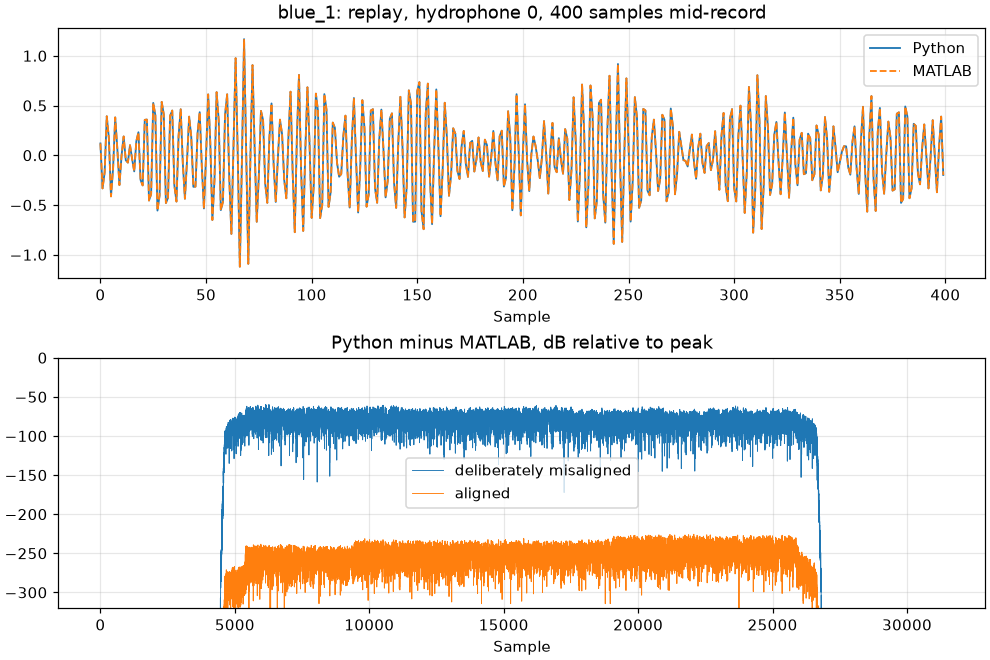
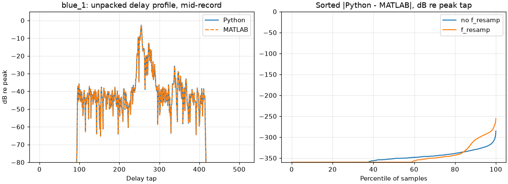
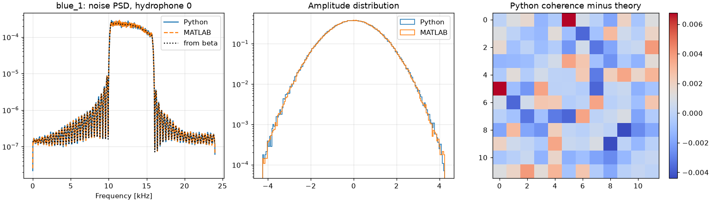
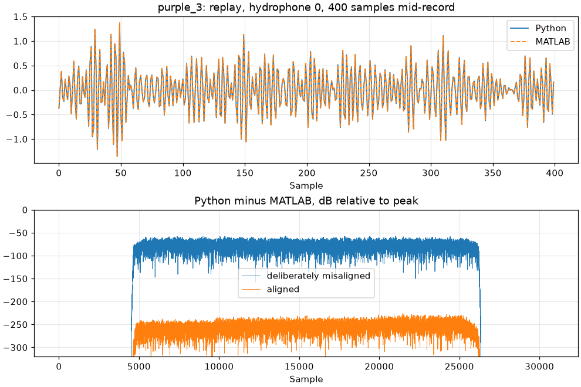
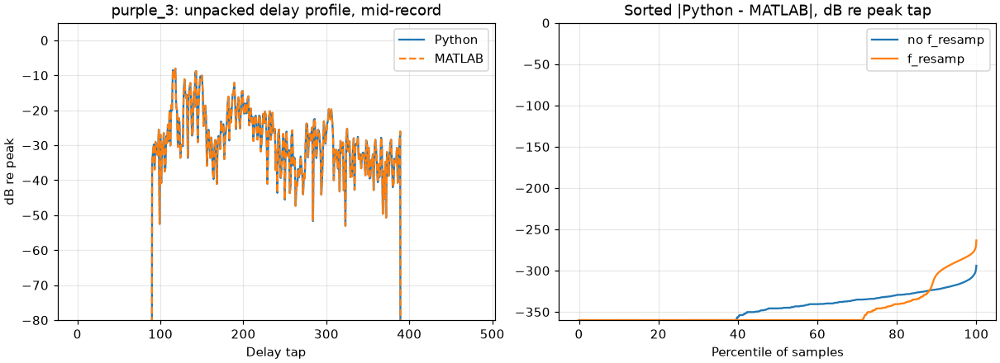
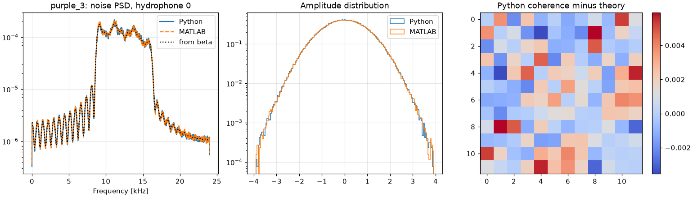

# Cross-implementation calibration report

Files from Zenodo record [21287414](https://doi.org/10.5281/zenodo.21287414).  Both runners were handed the same probe samples from `probe.mat`, so nothing in the replay or unpack comparisons depends on a random number generator.

## blue_1 (`blue_1.mat`, `blue_noise.mat`)

### Replay (blue_1)

Python start 100000, MATLAB start 100001, hydrophones [0, 3, 7] (0-based).  Python returns 31748 samples, MATLAB 31846 (MATLAB's `buffer = 20`, resampled by q/p).  The comparison uses the common interior, dropping 200 samples at each end.

| what is compared | NMSE | reading |
|---|---|---|
| resampler alone, no channel | **-259 dB** | `resample` and `resample_poly` build the same filter |
| replay, tracking removed | **-234 dB** | `h_hat` layout, spline interpolation, convolution, both resamplings and the up-conversion agree to the last bit |
| replay, tracking active | **-233 dB** | the delay/phase trajectory agrees too |
| ditto, MATLAB given `start` not `start+1` | **-60 dB** | a deliberate misalignment, to show the comparison resolves one |

### Unpack (blue_1)

Unpacked to 50 Hz on hydrophones [0, 3] (0-based), shape (512, 2, 2615) (delay, element, time), with and without `f_resamp = 0.9992406986`.

| what is compared | NMSE |
|---|---|
| unpack, no `f_resamp` | **-291 dB** |
| unpack, `f_resamp` active | **-260 dB** |
| how much `f_resamp` changes the output (Python) | **2 dB** |

The third row is the guard on the second: `f_resamp` has to change the output substantially, or the row above it would agree for the wrong reason.

### Noise (blue_1)

524288 samples on 12 hydrophones per implementation (10.9 s at 48 kHz), alpha = 2, beta (12, 12, 129).  The two draw from different pseudo-random streams, so they are compared as distributions, and each is also compared against what `beta` predicts.

| measure | Python vs MATLAB | Python vs `beta` | MATLAB vs `beta` |
|---|---|---|---|
| std, max rel. difference | 0.75% | - | - |
| excess kurtosis, max abs | 0.032 | 0.030 | 0.024 |
| KS statistic, max | 0.0084 | - | - |
| PSD, rms over 921 in-band bins | 0.397 dB | 0.283 dB | 0.283 dB |
| coherence, rms off-diagonal | 0.0030 | 0.0021 | 0.0024 |
| coherence vs *transposed* `beta` | - | 0.1402 | 0.1403 |

The last row is the control: `beta` is not symmetric in (i, j), so an implementation mixing `sum_j beta_ji z_j` instead of `sum_j beta_ij z_j` lands on the transposed covariance.  Both must be far closer to `beta` than to its transpose.

## purple_3 (`purple_3.mat`, `purple_noise_3.mat`)

### Replay (purple_3)

Python start 100000, MATLAB start 100001, hydrophones [0, 8, 16] (0-based).  Python returns 31280 samples, MATLAB 31353 (MATLAB's `buffer = 20`, resampled by q/p).  The comparison uses the common interior, dropping 200 samples at each end.

| what is compared | NMSE | reading |
|---|---|---|
| resampler alone, no channel | **-261 dB** | `resample` and `resample_poly` build the same filter |
| replay, tracking removed | **-232 dB** | `h_hat` layout, spline interpolation, convolution, both resamplings and the up-conversion agree to the last bit |
| replay, tracking active | **-232 dB** | the delay/phase trajectory agrees too |
| ditto, MATLAB given `start` not `start+1` | **-58 dB** | a deliberate misalignment, to show the comparison resolves one |

### Unpack (purple_3)

Unpacked to 65 Hz on hydrophones [0, 8] (0-based), shape (480, 2, 3471) (delay, element, time), with and without `f_resamp = 0.9992406986`.

| what is compared | NMSE |
|---|---|
| unpack, no `f_resamp` | **-298 dB** |
| unpack, `f_resamp` active | **-264 dB** |
| how much `f_resamp` changes the output (Python) | **1 dB** |

The third row is the guard on the second: `f_resamp` has to change the output substantially, or the row above it would agree for the wrong reason.

### Noise (purple_3)

524288 samples on 12 hydrophones per implementation (10.9 s at 48 kHz), alpha = 2, beta (24, 24, 65).  The two draw from different pseudo-random streams, so they are compared as distributions, and each is also compared against what `beta` predicts.

| measure | Python vs MATLAB | Python vs `beta` | MATLAB vs `beta` |
|---|---|---|---|
| std, max rel. difference | 0.67% | - | - |
| excess kurtosis, max abs | 0.027 | 0.014 | 0.020 |
| KS statistic, max | 0.0068 | - | - |
| PSD, rms over 2049 in-band bins | 0.401 dB | 0.340 dB | 0.340 dB |
| coherence, rms off-diagonal | 0.0037 | 0.0023 | 0.0027 |
| coherence vs *transposed* `beta` | - | 0.1075 | 0.1076 |

The last row is the control: `beta` is not symmetric in (i, j), so an implementation mixing `sum_j beta_ji z_j` instead of `sum_j beta_ij z_j` lands on the transposed covariance.  Both must be far closer to `beta` than to its transpose.

## Verdict

| check | value | tolerance | |
|---|---|---|---|
| blue_1: resampler control | -258.6 dB | -200 dB | pass |
| blue_1: replay with no tracking | -233.6 dB | -200 dB | pass |
| blue_1: replay with tracking | -233.3 dB | -200 dB | pass |
| blue_1: one-sample offset is detected | 60.14 dB | 100 dB | pass |
| blue_1: replay lag, hydrophone 0 | 0 samples | 0 samples | pass |
| blue_1: replay lag, hydrophone 3 | 0 samples | 0 samples | pass |
| blue_1: replay lag, hydrophone 7 | 0 samples | 0 samples | pass |
| blue_1: unpack without f_resamp | -291.2 dB | -200 dB | pass |
| blue_1: unpack with f_resamp | -259.5 dB | -200 dB | pass |
| blue_1: f_resamp actually does something | -2.351 dB | 20 dB | pass |
| blue_1: noise std, max relative difference | 0.007539  | 0.02  | pass |
| blue_1: excess kurtosis vs Gaussian (Python) | 0.03019  | 0.15  | pass |
| blue_1: excess kurtosis vs Gaussian (MATLAB) | 0.02406  | 0.15  | pass |
| blue_1: noise KS statistic, max | 0.0084  | 0.01  | pass |
| blue_1: noise PSD, rms Python-vs-MATLAB | 0.3969 dB | 0.8 dB | pass |
| blue_1: coherence, Python vs MATLAB | 0.003024  | 0.03  | pass |
| blue_1: coherence, Python vs theory | 0.00207  | 0.03  | pass |
| blue_1: coherence, MATLAB vs theory | 0.002401  | 0.03  | pass |
| blue_1: closer to beta than to its transpose (Python) | 0.00207  | 0.1402  | pass |
| blue_1: closer to beta than to its transpose (MATLAB) | 0.002401  | 0.1403  | pass |
| purple_3: resampler control | -260.7 dB | -200 dB | pass |
| purple_3: replay with no tracking | -232.1 dB | -200 dB | pass |
| purple_3: replay with tracking | -232.1 dB | -200 dB | pass |
| purple_3: one-sample offset is detected | 57.5 dB | 100 dB | pass |
| purple_3: replay lag, hydrophone 0 | 0 samples | 0 samples | pass |
| purple_3: replay lag, hydrophone 8 | 0 samples | 0 samples | pass |
| purple_3: replay lag, hydrophone 16 | 0 samples | 0 samples | pass |
| purple_3: unpack without f_resamp | -298.3 dB | -200 dB | pass |
| purple_3: unpack with f_resamp | -264.3 dB | -200 dB | pass |
| purple_3: f_resamp actually does something | -1.138 dB | 20 dB | pass |
| purple_3: noise std, max relative difference | 0.006694  | 0.02  | pass |
| purple_3: excess kurtosis vs Gaussian (Python) | 0.01368  | 0.15  | pass |
| purple_3: excess kurtosis vs Gaussian (MATLAB) | 0.02043  | 0.15  | pass |
| purple_3: noise KS statistic, max | 0.006767  | 0.01  | pass |
| purple_3: noise PSD, rms Python-vs-MATLAB | 0.4007 dB | 0.8 dB | pass |
| purple_3: coherence, Python vs MATLAB | 0.003725  | 0.03  | pass |
| purple_3: coherence, Python vs theory | 0.002273  | 0.03  | pass |
| purple_3: coherence, MATLAB vs theory | 0.002695  | 0.03  | pass |
| purple_3: closer to beta than to its transpose (Python) | 0.002273  | 0.1075  | pass |
| purple_3: closer to beta than to its transpose (MATLAB) | 0.002695  | 0.1076  | pass |

40 of 40 checks pass.
